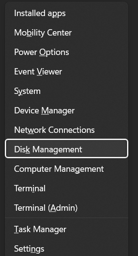
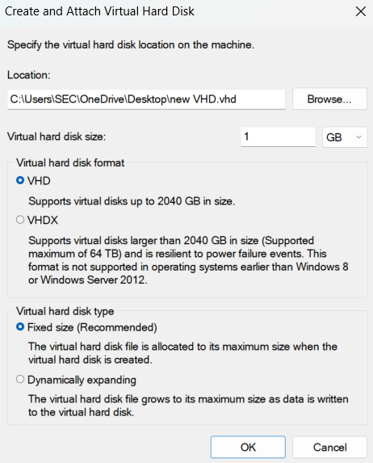
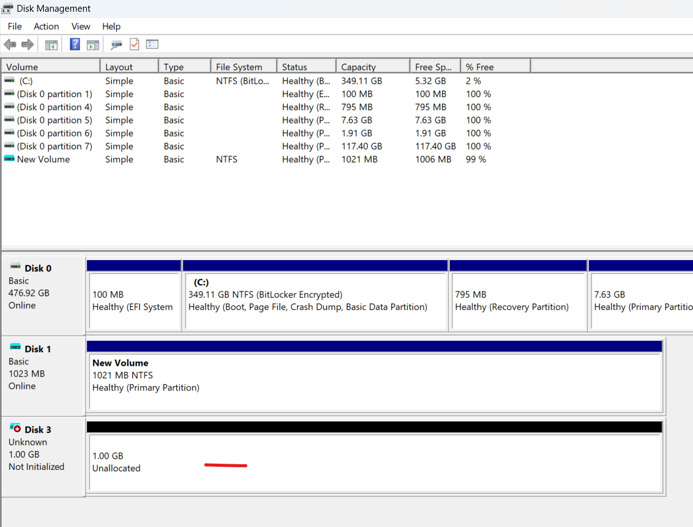
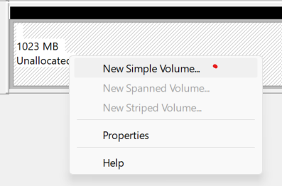
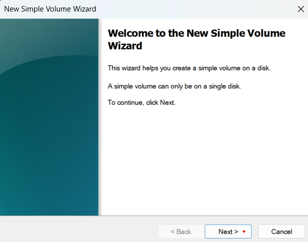
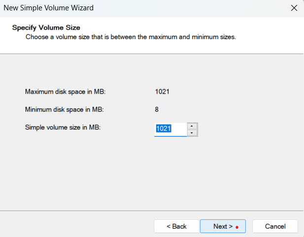
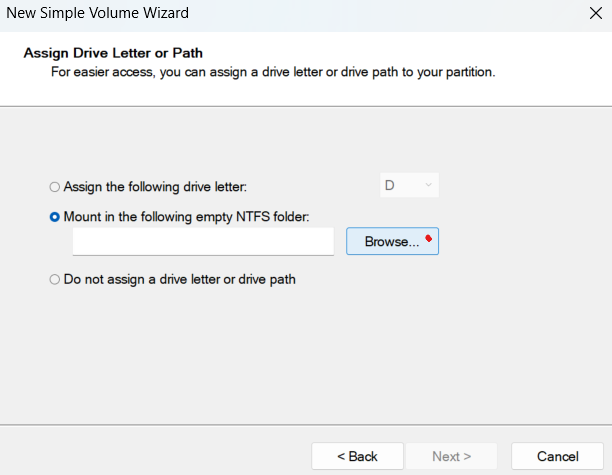
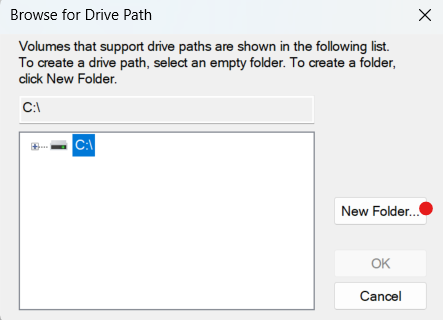

# File_Recovery-using-Autopsy

## Aim
The objective of this guide is to demonstrate how to:  
 - Create a **Virtual Hard Disk (VHD)**.  
 - Add images to the disk, delete them, and recover them using **Autopsy**.  
 - Understand the forensic recovery process for deleted files.  
 - Learn how to remove the virtual disk after completing the experiment.

## Virtual Disk Creation & File Recovery using Autopsy 

## Step 1: 
   Create a Virtual Hard Disk (VHD) 

### **1. Open Disk Management**  
- Press **Windows + X** → Click **Disk Management** 
 

### **2. Create a New VHD**  
- Click **Action** (top menu) → **Create VHD**.  

### **3. Choose File Location & Size**  
- Click **Browse** and select where to save the VHD file (e.g, `C:\new VHD.vhd`)
- Set the **size** (e.g: `1GB`) 
- Choose **VHD (Fixed Size)** and Click **OK**

### **4. Initialize the Disk**  
- In **Disk Management**, find your new disk (marked as "Not Initialized").  
 

- Right-click the disk → Click **Initialize Disk**.

- Select **MBR (Master Boot Record)**. 

### **6. Create & Format the Partition**  
- Right-click the **Unallocated Space** → Click **New Simple Volume**.  

- Click **Next** → **Click on Mount in the following empty NTFS folder** → **Browse** → **Assign a drive letter (e.g., `C: or D:`)** → **New folder** → **OK**

- Click **next** → **Finish**.  

## **Step 2: Add & Delete Files for Recovery**  
### **1. Copy Files to the Virtual Disk**  
- Open **File Explorer** → Go to the new drive (`D:`).  
- Create a new folder (`TestFolder`) and copy **4 images** into it.  

### **2. Delete the Files**  
- Select all four images → Press **Delete**.  
- Empty the **Recycle Bin** to permanently delete them.  

---

## **Step 3: Recover Deleted Files Using Autopsy**  
### **1. Open Autopsy & Create a New Case**  
- Launch **Autopsy 4.21.0**.  
- Click **Create New Case**.  
- Enter a **Case Name** (e.g., `File Recovery Test`).  
- Choose a **Case Folder** location.  
- Click **Next** → Add optional details → Click **Finish**.  

### **2. Add the Virtual Disk as an Evidence Source**  
- Click **Add Data Source**.  
- Select **Local Disk** → Choose the VHD drive (`D:`).  
- Click **Next** → Keep default settings → Click **Finish**.  
- Wait for Autopsy to process the disk.  

### **3. Recover Deleted Files**  
- Go to **File Analysis** (left panel).  
- Click **Deleted Files** → Find your deleted images.  
- Right-click an image → Click **Extract File**.  
- Select a folder to save the recovered files (e.g., `C:\RecoveredFiles`).  

✅ **Your deleted images are now recovered!**  

---

## **Step 4: Delete the Virtual Disk (Optional Cleanup)**  
### **1. Detach the VHD**  
- Open **Disk Management** (`Win + X` → Disk Management).  
- Find the **virtual disk** (`D:`).  
- Right-click the disk (not the partition) → Click **Detach VHD**.  

### **2. Delete the VHD File**  
- Open **File Explorer**.  
- Go to the location where you saved the `.vhd` file (e.g., `C:\AutopsyTest.vhd`).  
- **Delete** the `.vhd` file.  
- Empty the **Recycle Bin**.  

✅ **Your virtual disk is completely removed!**  

---

## **Tools Used**  
- **Windows Disk Management** (for creating a VHD).  
- **Autopsy 4.21.0** (for file recovery).  

---

## **Screenshots**  
_(Upload screenshots here if needed for better understanding.)_  

---

## **Conclusion**  
This guide demonstrated how to:  
✅ Create a **Virtual Hard Disk (VHD)**.  
✅ Add, delete, and recover images.  
✅ Use **Autopsy** for forensic file recovery.  
✅ Delete the virtual disk after completing the experiment.  

---

🚀 **Now you can test data recovery techniques easily!** Let me know if you need further improvements.  

